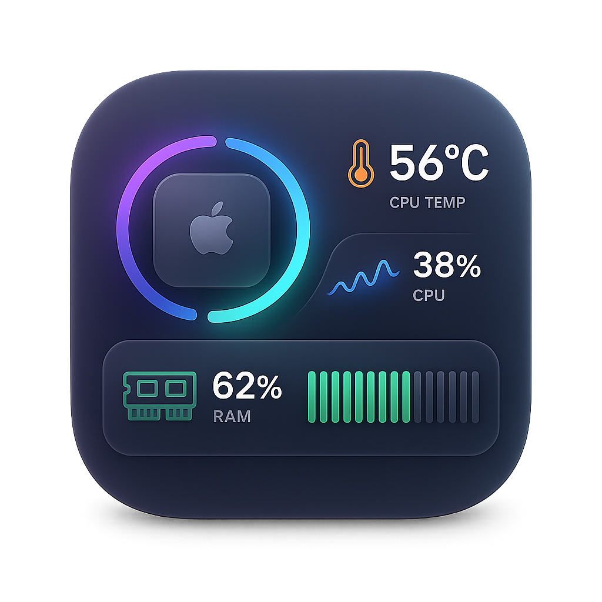
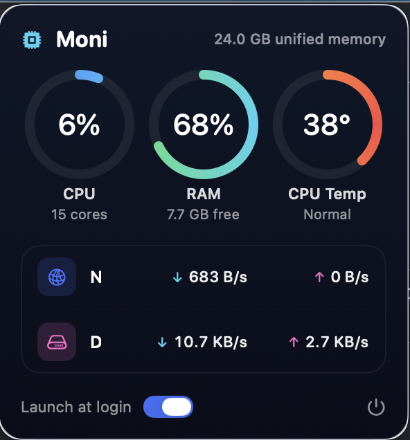

<div align="center">



# Moni

**A tiny, native menu-bar system monitor for Apple Silicon Macs.**

Live CPU load, RAM usage, CPU temperature, and network / disk throughput —
in a clean menu-bar popover that uses **~0% CPU when closed**.

<br/>



</div>

---

## Features

- 🧊 **CPU** load, **RAM** usage, and **CPU temperature** as clean ring gauges
- 🌡️ Real on-die temperature on Apple Silicon (no `sudo`, no kext)
- 🌐 Live **network** (↓/↑) and **disk** (read/write) throughput
- 🪶 **Featherweight**: the polling timer only runs while the popover is open —
  closed, the app sits at ~0% CPU
- 🚀 **Launch at login** toggle (via `SMAppService`)
- 🔒 100% local — no network access, no telemetry, no elevated privileges
- 🖥️ Lives in the menu bar only (no Dock icon)

## Requirements

- **Apple Silicon** Mac (M1 or newer)
- **macOS 14 Sonoma** or later

## Install

1. Download the DMG:
   - from the [**Releases**](../../releases) page, **or**
   - directly: [**installation/Moni-1.0.dmg**](installation/Moni-1.0.dmg) (click, then **Download**).
2. Open the DMG and drag **Moni** into **Applications**.
3. Launch it. Because the app is **ad-hoc signed** (no paid Developer ID),
   macOS Gatekeeper will warn on first launch:
   - Right-click **Moni.app → Open**, then confirm, **or**
   - **System Settings → Privacy & Security → Open Anyway**.

You only need to do this once. The Moni icon then appears in your menu bar —
click it for the stats popover.

## Build from source

You need **Xcode 16+** (Swift 6) command-line tools.

```bash
git clone https://github.com/BadmintonAdmin/moni.git
cd moni

# Build and install into /Applications:
./build.sh

# …or build a distributable DMG (into dist/):
./make-dmg.sh
```

## How it works

All metrics come from cheap, public-ish system interfaces sampled every ~1.5s
**only while the popover is visible**:

| Metric       | Source |
|--------------|--------|
| CPU load     | `host_processor_info` tick counters (delta between samples) |
| RAM          | `host_statistics64` (VM stats) + `hw.memsize` |
| CPU temp     | Private `IOHIDEventSystemClient` thermal sensors (averaged across the CPU/SoC die) — same approach as Stats/btop, no root required |
| Network      | `getifaddrs` interface byte counters |
| Disk         | IOKit `IOBlockStorageDriver` statistics |
| Thermal state| `ProcessInfo.thermalState` |

> **Note on temperature:** Apple provides no public API for on-die temperatures,
> so Moni reads them via a private (but unprivileged) IOKit interface. If your
> chip exposes no usable sensor, the temperature ring shows `—`.

## Project layout

```
Sources/
  CIOHID/        C shim exposing the private IOHID symbols
  Moni/
    MoniApp.swift          @main, MenuBarExtra
    StatsPanel.swift       the popover UI
    Components/            ring gauge, badges, theme, helpers
    Metrics/               CPU / Memory / Temp / IO samplers + model
    LoginItem.swift        SMAppService wrapper
scripts/build-app.sh       builds Moni.app (used by both scripts below)
build.sh                   build + install to /Applications
make-dmg.sh                build + package a DMG
```

## License

[MIT](LICENSE)
